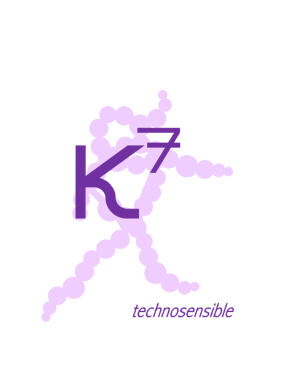

Title: À propos de nous
Date: 2024-08-22
Status: published
Category: About

# Bonjour 🎉

Bienvenue sur notre site ! Nous sommes ravies de vous présenter notre projet K7 technosensible : notre média, notre studio et notre lab. Ici, vous découvrirez les productions de nos numéros, des ressources et des informations sur nos activités. Nous avons pour mission de  marier création, technologie (l'IA en particulier) et questions de société dans un univers poétique et prospectif.

## Notre Histoire

Nous sommes Zoé Pasquier et Myriam Hammad, diplômées de l’ENSCi - les Ateliers avec des parcours précédents issus des sciences sociales et de la communication. Nous souhaitons appliquer des méthodologies de design au sein des médias, un univers au sein duquel nous avons chacune pu évoluer lors de nos expériences professionnelles précédentes. Nous partageons aussi un goût et une approche par le sensible pour explorer le monde qui nous entoure et souhaitons ainsi poursuivre cette démarche par le biais de la création numérique appliquée aux médias, de l’expérimentation et de la médiation. Nous nous adressons ainsi à l’ensemble des métiers créatifs, à celles et ceux qui se demandent comment traiter le sujet de l’intelligence artificielle, mais aussi à toutes les personnes qui aspirent à des respirations sensibles et poétiques dans leur quotidien.
Notre projet média K7 Technosensible s’empare de l’IA pour parler du quotidien et de ses joies, de ses farfeluteries et de sa complexité avec bienveillance et sensibilité. Le quotidien s’inscrit entre hier et demain et c’est cette temporalité qui nous intéresse. Savoir ce qu’il s’est passé hier dans un endroit, comprendre comment cela résonne aujourd’hui, ce qui fait lieu, ce qui fait récit, imaginer ce lieu et sa vie demain.
K7 c’est un média qui parle du quotidien, qui expérimente, qui organise des tables rondes avec des experts et expertes, des chercheuses, chercheurs et des artistes, c’est un média qui fait de la poésie parce que l’information n’a pas d’obligation d’être ni sensationnaliste ni tonitruante. Les expérimentations, l’écriture, elle, se fait de notre côté avec notre patte, et se couple à l’IA générative.

L’IA est considérée comme outil de collaboration, de co-écriture audiovisuelle, comme un outil qu’on analyse et utilise pour mieux le maîtriser. S’en saisir permet de voir ses possibles au-delà de visions de géants de la tech, au-delà d’usages communs dans de nombreuses entreprises où ces outils numériques répondent uniquement à ces objectifs : automatiser, gagner du temps, gagner de l’argent.

Pour l’instant, peu d’IA frugales existent, mais l’idée de K7 est de les mettre en valeur, d’investiguer pour identifier les différents modèles et leurs usages. Toute cette partie de recherche et expérimentation se déroule au sein de notre Lab, un espace temporel et numérique où l’on expérimente les nouveaux outils fraîchement (ou non) arrivés dans le plus en plus vaste monde de l’IA. Ces expérimentations, cette documentation et expertise nous sert pour conseiller, accompagner, démocratiser, faire de la pédagogie autour des outils d’IA et leur fonctionnement.

Notre méthodologie et nos pratiques se veulent :
- participatives : les sujets de nos numéros sont choisis à partir de questions posées aux individus sur les réseaux sociaux, les forums ou les micro-trottoirs. Nos critères de sélection sont rendus transparents et sont une adéquation entre nos univers poétique et sensible et leur déclinaison possible sous nos différents formats;
éco-conscientes : le projet K7 technosensible porte une attention particulière sur l’impact énergétique des outils d’IA générative - notre démarche se trouve ainsi à un carrefour. Nous avons conscience de la consommation énergétique que ces outils représentent et nous serons résolument tournées vers une approche par l’IA frugale et l'éco-conception numérique de notre site internet. Pouvoir porter un regard critique nous demande cependant de pouvoir tester et utiliser la palette d’outils disponibles;
- empathiques : nous accordons une importance particulière à l’écoute des individus que nous rencontrons et souhaitons pouvoir les impliquer au mieux pour capter leurs opinions et leurs ressentis sur nos travaux à travers des rencontres et des tables rondes;
créatives : nous accordons une place importante à la liberté de création, à l’expérimentation et au test qui sont les fondements de nos méthodes de travail;
critiques : nous nous positionnons comme une tour de veille sur les outils d’IA et les stratégies à l'œuvre des grands acteurs afin de pouvoir produire un contenu critique, réfléchi et renseigné au sein de notre studio.

## Contact

Pour toute question, vous pouvez nous contacter à l'adresse suivante : [K7technosensible@gmail.com](mailto:K7technosensible@gmail.com).
