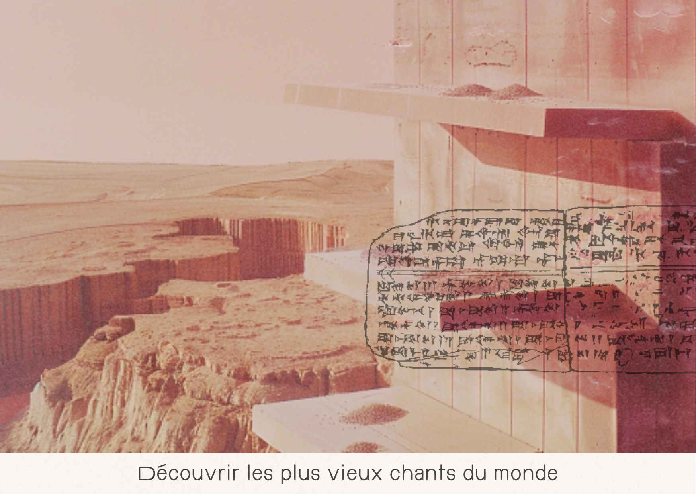
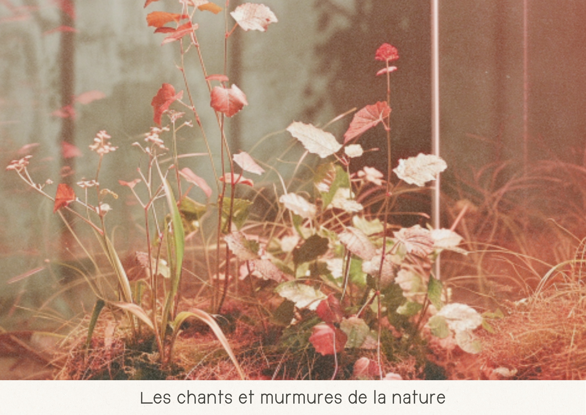
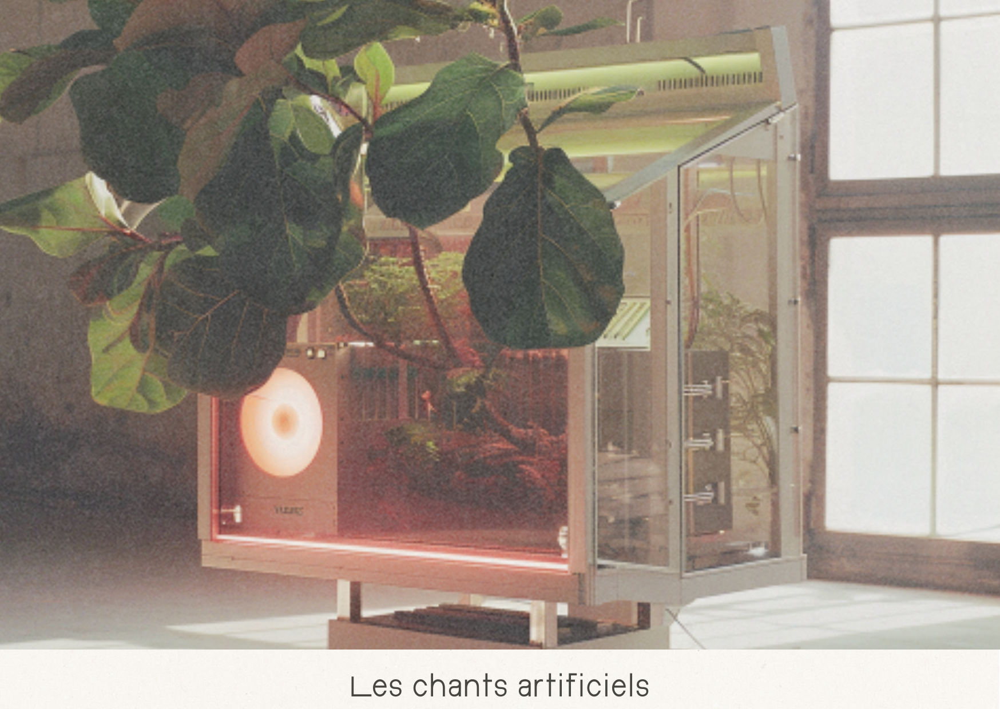

Title: Balade dans les chants * CHANTER n°1 *
Date: 2024-08-22
Category: Media 🌺
Tags: Numéro 1
Author: Myriam Hammad
Order: 2
Status: published

## Procédé

  Pour la rédaction de cet article, la dernière version de ChatGPT -ChatGPT4.0 a été utilisée - dans un premier temps pour faire des recherches, notamment historiques sur les plus vieux chants du monde. Puis dans un second temps, pour trouver des spécialistes ayant rédigé des articles scientifiques et académiques sur les effets psychologiques du chant et ayant été reconnus dans leur domaine. Cette base de recherches a été vérifiée et a permis assez rapidement de pouvoir entrer plus en profondeur dans chacun des chapitres. Les illustrations de chaque article ont été réalisées avec midjourney et le code de référence **--sref 3038856255** afin d'harmoniser les rendus des visuels. Enfin, [Suno.ai](http://Suno.ai) permet en dernière partie de composer des sons (instrumentaux ou avec paroles) permettant d'accompagner l'atmosphère et le ressenti de l'ensemble de l'article de manière sonore, avec le prompt suivant : “ *i want a sound very natural like the old grec songs made by saphho which give an impression of walking through different periods of time and songs* - no folk”.

## Introduction

 Savez-vous ce que sont [les vers d’oreille](https://www.radiofrance.fr/francemusique/quand-une-melodie-nous-obsede-qu-est-ce-qu-un-ver-d-oreille-2159838) ? Ce sont ces petits airs qui vous trottent dans la tête un ou plusieurs jours, qui surviennent lorsque vous pratiquez des activités qui vous demandent peu de concentration. Parfois, vous ne vous en rendrez même pas compte. Il s’agit d’une impression musicale qui surgit spontanément et qui  se répète en boucle. Ce ver, ce refrain, ce fredonnement, que vous gardez si longtemps en tête, n’est autre qu’un souvenir musical parmi ceux les plus ancrés dans votre mémoire et indissociable de votre propre histoire personnelle. C’est là l’une des plus grandes forces du chant et des mélodies sur nous-même. 

S’intéresser aux chants, c’est s’intéresser à un type d’expression, à un langage, un art hérité  depuis des millénaires. Protéiforme et universel, il peut être lyrique, populaire, guerrier, religieux, poétique, léger.  Il peut être source de cohésion ou au contraire marquer des différences d’appartenance de groupe ; il peut galvaniser, impressionner ou apaiser et rassurer, faire rêver. Il peut divertir ou former, mais aussi embrigader, élever l’âme ou l’assujettir à des instincts primaires. Il se pratique seul ou en groupe, parfois à l’échelle d’une nation, d’un continent ou du monde entier.. Il est l’apanage du vivant et connaît aujourd’hui une grande évolution avec l’arrivée des chants artificiels.  Voici un tour d’horizon sur l’une des pratiques les plus universelles du monde des vivants et ses enjeux actuels.

### Aux origines des chants du monde

Pourquoi et quand les premiers humains se sont-ils mis à chanter ? Lorsque l’on commence à se poser cette question, on en arrive assez rapidement à s’interroger sur les origines du chant. L’’on retrouve des traces de musique à l’ère préhistorique, on parle d’ailleurs de musique préhistorique. Avec la peinture, le chant a constitué l’une des premières formes d’expression humaine. Le plus vieil instrument de musique a été retrouvé dans la **Souabe, une région aujourd’hui proche de la Forêt Noire en Allemagne.** Vieux de près de 42 000 ans il s’agissait d’une flûte construite en os de vautour.

  <iframe width="560" height="315" src="https://www.youtube.com/embed/NXU2oBpHJYc?si=gj5_GAmkwEPUHkvd" title="YouTube video player" frameborder="0" allow="accelerometer; autoplay; clipboard-write; encrypted-media; gyroscope; picture-in-picture; web-share" referrerpolicy="strict-origin-when-cross-origin" allowfullscreen></iframe>

D’autres chants sont supposés avoir existé avant cette période - mais leur trace n’a jamais été retrouvée. Le plus ancien retrouvé complet est l’Hymne à Nikkal , datant de 1400 avant notre ère. Il est d’origine Ougarit (une ancienne cité portuaire située dans l'actuelle Syrie). Il a été retrouvé inscrit sur une tablette d’argile en 1950 qui comportait une écriture cunéiforme correspondant à une mélodie avec des annotations musicales. Le chant a été crée en hommage à Nikkal, déesse des vergers. La tablette comportait aussi des instructions pour pouvoir jouer cet air avec un instrument à cordes - probablement une lyre.  Des spécialistes en musique ancienne, comme Anne Draffkorn Kilmer, ont étudié les indications pour reconstituer la mélodie en utilisant des instruments répliqués à partir de ceux de l'époque.

<iframe width="560" height="315" src="https://www.youtube.com/embed/pIR2YwK_Bkg?si=8l7vtpnI9wr2CoGQ" title="YouTube video player" frameborder="0" allow="accelerometer; autoplay; clipboard-write; encrypted-media; gyroscope; picture-in-picture; web-share" referrerpolicy="strict-origin-when-cross-origin" allowfullscreen></iframe>

### Le rythme : une rassurante régularité pour se protéger

Ces premiers chants retrouvés ont aussi permis de nous renseigner sur les usages du chant par les premières populations. Pour le médecin suédois Matz Larsson, de l'[**hôpital universitaire d’Örebro](http://www.orebroll.se/en/Orebro-University-hospital/),** si les premiers individus se sont mis à chanter, cela est principalement dû à des raisons liées à l’évolution et à la survie humaine. Il explique que la traversée d'un espace dangereux demandait une grande concordance des foulées. En a découlé un groupe d'humains qui, sans s'en rendre compte a commencé à marcher au pas. Cette régularité, rassurante est venue donner un premier rythme. Cette pratique s’est accompagnée d'un renforcement cérébral : en a résulté une sécrétion de [**dopamine**](http://www.futura-sciences.com/magazines/sante/infos/actu/d/medecine-dopamine-molecule-plaisir-sensibilite-dependances-9030/), souvent considérée comme l'hormone de la récompense. Ainsi, le soir, au coin du [**feu**](https://www.futura-sciences.com/sciences/definitions/chimie-feu-15905/), les groupes pouvaient se retrouver et taper des [**mains**](http://www.futura-sciences.com/magazines/sante/infos/actu/d/biologie-main-humaine-t-elle-evolue-mieux-boxer-43545/) et des pieds en communion, pour se soulager de leurs craintes.

  

Leur cerveau a propulsé cette dopamine apaisante. Le langage se perfectionnant au même moment, la voix a fini par créer des mélodies par-dessus des « boum boum » réguliers donnant lieu à la naissance de la musique. Si l’humain a eu besoin de chanter, c’est pour transmettre une émotion, appartenir à un groupe. La transmission et la communication des émotions sont devenues indispensables à la survie humaine. Avec le temps et le développement de l’écriture, on a retrouvé la manifestation de ces émotions à travers la poésie inexorablement liée au chant.

## Comprendre le lien entre la poésie, l’émotion et le chant

  

### L’Antiquité  et Sappho : le passage du poème à la mélodie

C’est à l’Antiquité que le chant et la poésie se développent et que les deux pratiques vont progressivement interagir pour donner lieu à des chansons qui sont composées de trois éléments : texte, voix et mélodie. Se pose alors la question suivante: pourquoi mettre en musique un texte et rechercher une forme de travail et de complexité dans la mélodie ? N’aurait-il pas suffi de réciter le poème pour partager l’émotion ? Dans les anthologies des chants populaires de diverses cultures, des contes chantés sont souvent catégorisés en chapitres. Une grande partie de ces chapitres représentent des chansons qui expriment un état d’âme à travers leurs vers : berceuses, chants d’amour, deuils, éloignements. Ils sont aussi utilisés comme des chants historiques liés à la mémoire d’un événement ayant fortement marqué le sentiment collectif. Ils viennent également accompagner des rituels. Mais quel est donc l’ élément qui  porte l’émotion et à quel degré ? En effet, très souvent, le poème lui-même est déjà fortement chargé affectivement. Mais ici, l’on constate que l’affect se transmet encore mieux avec le texte **et** la mélodie et que cela produit un effet très intime partagé entre celui ou celle qui chante et ceux qui l’écoutent.

  

L’Antiquité grecque est particulièrement riche pour observer ce phénomène :  l’on retrouve cette forme dans les chants de Sappho. La poétesse et musicienne a composé de nombreux chants d’amour qu’elle interprétait accompagnée de sa lyre. Bien qu’elle soit restée célèbre comme poétesse et non comme compositrice – la mélodie de ces chants n’a pas pu être transmise jusqu’à nos jours – il s’agissait bien de chansons. À cette époque,  les écoles de poésie étaient aussi des écoles de musique. On dit aussi de Sappho  qu’elle aurait inventé le plectre, ce petit bout de bois ou d’os qui permet de pincer les cordes. Elle était très souvent entourée d’un choeur de jeunes femmes qui chantait avec elle des odes. Elle aurait aussi crée une échelle de notes connue aujourd'hui sous le nom de gamme mixolydienne - la plus triste n’ayant jamais existé selon Platon.

  <iframe width="560" height="315" src="https://www.youtube.com/embed/F-0cAFeqokY?si=qxKNYylGlDAxf8Cw" title="YouTube video player" frameborder="0" allow="accelerometer; autoplay; clipboard-write; encrypted-media; gyroscope; picture-in-picture; web-share" referrerpolicy="strict-origin-when-cross-origin" allowfullscreen></iframe>

### Les explications de la puissance de la mélodie par la musicologie

La recherche en musicologie s’accorde à dire que la mélodie apportée au poème par le chant , accompagnée par la voix humaine se charge d’un message émotionnel qui ne passe pas par les mots mais par les sens. Leurs observations montrent que plus le chant sert la parole et donc le sens, plus la mélodie est syllabique, tandis que quand il vise plutôt à l’expression de l’émotion, la voix s’exprime à travers la mélodie mélismatique, des vocalises et des ornements sans support verbal, en brodant librement autour de l’idée musicale. C’est comme si les ondes des ornements vocaux traduisaient les vibrations affectives de façon plus immédiate et fidèle que les mots.

*Dans l'art musical, un **mélisme** est une figure mélodique de plusieurs notes consécutives portant une même syllabe Le style mélismatique s'oppose au style [syllabique](https://fr.wikipedia.org/wiki/Syllabique), dans lequel chaque syllabe du texte est chantée par une seule note. Le mélisme est le plus souvent une mélodie conjointe, donc formée de notes voisines.*

  

### Découvrir la beauté de la musique mélismatique

La musique classique et populaire orientale regorge d’improvisations virtuoses et mélismatiques chantées en solo: [les gazel](https://www.youtube.com/watch?v=KQ6IPOPjUb0&list=PLD94W6D2tmZaGag4o-evmDziO6QyxGTEc) en musique classique ottomane, le samané en musique grecque populaire (rebetiko), les mawwal dans la musique arabe. Ces passages vocaux expriment souvent des émotions profondes tels que l’amour, le chagrin, le deuil, la douleur de l’exil et sont souvent le moment le plus précieux du concert où le public voit le chanteur s’investir affectivement Dans ce genre, une belle improvisation est aussi remarquable qu’une composition écrite. C’est d’ailleurs ainsi que les grands chanteurs comme Hafiz Sami ou Hafiz Osman (musique classique ottomane), Roza Ashkenazy (rebetiko grec) ou Farid-Al-Atrash (musique arabe) sont restés dans l’histoire des genres respectifs.

  <iframe width="560" height="315" src="https://www.youtube.com/embed/YKzKJtELJ8s?si=fbrKq7gbKSmAbynr" title="YouTube video player" frameborder="0" allow="accelerometer; autoplay; clipboard-write; encrypted-media; gyroscope; picture-in-picture; web-share" referrerpolicy="strict-origin-when-cross-origin" allowfullscreen></iframe>

Surtout, le chant peut mettre en valeur un texte signifiant, qui peut faire appel aux sentiments de l’auditeur (nostalgie, amour, puissance, vengeance, dureté, amusement, fierté, transcendance…). Tantôt accompagné de mélodie, tantôt de jeux sur les vibratos,  il crée un effet psychologique qui peut être particulièrement puissant.

## Enchanter nos corps : sentir le pouvoir de l’affect

  

### L’effet psychologique du chant

L’effet psychologique du chant a été mis en évidence dans les années 1960 et prouvé par la neuropsychologie depuis 1985. Depuis de nombreuses années, les recherches  en psychologie et en neurosciences tendent à démontrer que la voix est un stimulus sonore «prioritaire» pour le cerveau humain, qui le traite plus vite que d’autres bruits - Voir le rapport entre le chant et les émotions de  Konopczynski G (1). Le cerveau reconnaît les voix aussi vite que les visages, ce qui montre que les voix sont le lieu d’un investissement particulier. Édith Lecourt, Professeure de psychologie clinique à Paris V forme l’hypothèse que dans les premières empreintes sonores et musicales se trouvent les premiers schémas musicaux, y compris les intervalles de l’harmonie que l’on retrouverait dans les groupes familiaux.

  

Ainsi, nous comprenons mieux pourquoi le chant se charge d’un tel pouvoir affectif pour le chanteur mais aussi pour ses auditeurs. Ce dernier va éprouver la catharsis de ses propres sentiments à travers l’identification au chanteur et le message affectif transmis par son chant. C’est pour cela que l’auditeur choisit inconsciemment d’entendre un chant proche de son état d’âme actuel ; cela lui permet de s’y identifier. Et c’est à cause de ce grand pouvoir affectif qu’il existe aujourd’hui, des approches en musicothérapie (Reinhart, Bachli, Alvin) qui utilisent les éléments isolés de la musique pour changer l’état d’âme actuel vers un nouvel état d’âme, induit par la musique.  

Par ailleurs, l’écoute de la musique produit de réelles manifestations physiques : le corps réagit avec tous les symptômes de l’excitation émotionnelle. On observe que :

- les pupilles se dilatent ;
- le pouls et la pression artérielle augmentent ;
- la conductance électrique de la peau s’abaisse ;
- le cervelet (région du cerveau associée au mouvement du corps) devient très actif ;
- le sang est redirigé vers les muscles des jambes.

Comme l’explique Sarah Wilson, de l’Ecole des sciences psychologiques de l’Université de Melbourne : « *Le chant est une forme de thérapie naturelle. Lorsque l'on observe les IRM des personnes en train de chanter, on voit les régions très étendues s’activer dans le cerveau, et cela est le cas à la fois si la personne chante et si elle ne fait que de s'imaginer chanter. Les régions concernées sont les régions motrices, celles responsables de l’audition ou de l’écoute, les régions en charge de la planification et de l’organisation, ainsi que celles qui supervisent la mémoire. Si l'on chante une chanson à texte, le traitement du langage est aussi impliqué, le tout en lien avec les émotions qui renforcent le lien social et l’empathie. La complexité du chant est un vrai défi pour le cerveau, même si nous avons l’impression que c’est un processus très simple, »* conclut la chercheuse.

### Les bienfaits du chant collectif

Chanter [en groupe](https://www.lavie.fr/actualite/societe/pourquoi-chanter-fait-du-bien-a-notre-cerveau-88856.php) stimulerait aussi notre sociabilité en relançant notre taux d’ocytocine, comme l'explique Édith Lecourt. On sait aujourd’hui que cette hormone joue un rôle dans la cohésion du groupe et le lien entre l’enfant et ses parents. En 2014, le chercheur en sciences musicales allemand Gunther Kreutz a étudié [le taux d’ocytocine dans la salive de choristes](https://mmd.iammonline.com/index.php/musmed/article/view/MMD-6-2-9), à la suite une répétition et après une simple conversation en binôme. Résultat : la concentration d’ocytocine était significativement plus élevée après le chant choral qu’après la conversation. Les participants se sont aussi dits plus heureux après avoir chanté ensemble.

Et c’est ce qui explique que le chant constitue l’un de nos plus grands patrimoines. Les chants rituels anciens ont joué un rôle central dans la consolidation de nombreuses cultures à travers l'histoire, et à travers le monde souvent associés à des cérémonies religieuses, des rites de passage, et des célébrations communautaires. L’on peut citer pour leur beauté les chants Yorubas du Niger qui ont une forte dimension traditionnelle et qui sont utilisés lors de rites de passage ou pour invoquer les divinités comme les Orishas. Parents et enfants doivent obéir à des rythmes et des sonorités précises pour parvenir à les faire venir et que celles-ci exaucent leurs souhaits.

De nombreuses traditions chantées font aussi appel aux sons de la nature pour rendre hommage et créer une connexion entre les individus et la Nature. Certaines, perpétuées au fil des années sont venues constituer de véritables et profondes identités culturelles. C’est par exemple le cas du katajjaq : une forme unique de chant de gorge pratiquée principalement par les femmes inuites de l'Arctique canadien. Elles produisent des sons rythmiques en utilisant leur gorge, créant des mélodies complexes et des vibrations profondes.

<iframe width="560" height="315" src="https://www.youtube.com/embed/K_uodqAJr0I?si=5wuu3Ey2OZ_MuY_Z" title="YouTube video player" frameborder="0" allow="accelerometer; autoplay; clipboard-write; encrypted-media; gyroscope; picture-in-picture; web-share" referrerpolicy="strict-origin-when-cross-origin" allowfullscreen></iframe>

Aujourd'hui, le katajjaq  est devenu une forme d'art reconnue internationalement. Des artistes inuits contemporains l'intègrent dans leurs performances musicales mettant ainsi en valeur leur culture et leur héritage.

Les chants à travers le monde et à travers l’histoire ont existé pour transmettre des émotions entre les humains et créer une forme de connexion et de communion entre eux. Ils sont de véritables vecteurs des âmes et touchent à la partie la plus sensible des êtres humains. Les chants rituels, traditionnels, laissent aussi la part belle aux sons de la nature et cette dernière est de plus en plus écoutée pour intégrer pleinement notre patrimoine sonore.

(1)  Les enjeux de la voix, in Castarède M.F. et Konopczynski G., *Au commencement était la voix*, Éres, Toulouse, 2005, p. 43-44.

## Ecouter chanter la nature et décrypter ses murmures

Le monde animal et végétal est connu pour ses sons - mais ces derniers sont-ils de véritables chants ? Parmi les animaux “chanteurs”, l’on retrouve les oiseaux comme le rossignol, le rouge-gorge ou le merle noir célèbres pour leurs belles et complexes sonorités. Ces chants leur permettent principalement tout au long de l’année de défendre leurs territoires ou s’assurer de l’attirance de partenaires lors des périodes de reproduction.

<iframe width="560" height="315" src="https://www.youtube.com/embed/5L9HTz1zEBA?si=p4l2OkWKpN-SX1gG" title="YouTube video player" frameborder="0" allow="accelerometer; autoplay; clipboard-write; encrypted-media; gyroscope; picture-in-picture; web-share" referrerpolicy="strict-origin-when-cross-origin" allowfullscreen></iframe>

### Des fonctions encore méconnues des voix animales

D’autres mammifères - notamment marins utilisent le chant comme moyen de communication : les baleines à bosse, les bélugas et les orques. Ces chants leur permettent de pouvoir se repérer et de naviguer parfois sur de très longues distances - les baleines à bosse disposent d’une gamme de chants très complexes : certains d’entre eux peuvent durer près de 30 minutes et sont complètement fascinants pour l’oreille humaine. **L’on ignore encore aujourd’hui l’ensemble des fonctionnalités de ce chant et les mystères de ces langages sous-marins.**

<iframe width="560" height="315" src="https://www.youtube.com/embed/gDAScMExvMM?si=ui0_7syfKf-fRkLU" title="YouTube video player" frameborder="0" allow="accelerometer; autoplay; clipboard-write; encrypted-media; gyroscope; picture-in-picture; web-share" referrerpolicy="strict-origin-when-cross-origin" allowfullscreen></iframe>

D’autres encore, produisent  des chants comme les loups - ces derniers leur servent à coordonner le groupe - mais également à se donner de la motivation avant de partir à la chasse. Le loup est l’un des mammifères avec les chants les plus développés : Le hurlement de la meute a la particularité de constituer un véritable « chœur » : chaque animal a sa propre tonalité, ce qui fait que l’ensemble peut couvrir une tessiture de plusieurs octaves. Généralement, le mâle alpha inaugure le concert, suivi par sa louve, puis par les autres membres du groupe.  D’autres animaux sont considérés comme de véritables interprètes à l’instar des gibbons - les plus petits des grands singes qui se lancent dans des chants dès l’aube en couple. Ils envoient ainsi le message suivant : ils sont ensemble et cette partie de la forêt leur est réservée.. Ils disposent d’une grande gamme de vocalises très élargie et les couples chantent chacun en harmonisant sa voix sur celle de l’autre.

<iframe width="560" height="315" src="https://www.youtube.com/embed/FN5L-y0PAI4?si=a-SSrjlzF-M93Ut-" title="YouTube video player" frameborder="0" allow="accelerometer; autoplay; clipboard-write; encrypted-media; gyroscope; picture-in-picture; web-share" referrerpolicy="strict-origin-when-cross-origin" allowfullscreen></iframe>

### Des voix végétales émergentes grâce aux nouvelles technologies

Les animaux ne sont pas les seuls à produire des sons et des chants. Depuis plusieurs années, les végétaux sont aussi étudiés à travers les vibrations qu’ils peuvent produire au sein même de leurs structures. Des chercheurs - accompagnés par des spécialistes du son ont utilisé des électrodes pour capter les signaux électriques des plantes, qui peuvent ensuite être traduits en sons. On parle alors de biofeedback musical permettent d’enregistrer les signaux électriques des plantes et de générer leurs compositions à partir d’algorithmes de génération de musiques.

  

    <iframe 
      style="width:100%;height:100%;position:absolute;left:0;top:0;overflow:hidden;"
      frameborder="0"
      type="text/html"
      src="https://geo.dailymotion.com/player.html?video=x858l57"
      width="100%"
      height="100%"
      allowfullscreen
      title="Dailymotion Video Player"
      allow="web-share"
    >
    </iframe>
  

D’autres techniques, s’intéressent aux racines de certaines plantes qui semblent croître en direction des vibrations d'une source d'eau, indiquant une forme de "réponse" aux sons. Il a aussi été montré sur différents espaces : en plein champ, en laboratoire et sous serre, que des variations des taux de germination et de la croissance ainsi que certaines modifications de l'immunité et du comportement de végétaux se produisent en réponse à certaines fréquences et selon les périodes d'exposition et les distances de la source sonore.

Les expérimentations montrent que les racines des plantes ne répondent qu'aux ondes sonores émises à des fréquences correspondant aux ondes qu'elles émettent elles-mêmes. On suppose qu'elles peuvent recevoir et « transduire » des vibrations sonores en signaux capables de provoquer des modifications comportementales, ce qui revient à leur reconnaitre une forme de communication souterraine. Les “chants” des animaux et des végétaux conservent aujourd’hui encore beaucoup de mystères et doivent continuer à être explorés. 

Les nouvelles technologies et notamment l’intelligence artificielle peuvent permettre de venir défricher ces terrains et de mieux comprendre le fonctionnement et les liens avec notre nature. Pour autant, l’on peut se demander, assez légitimement si cet usage est même vraiment envisagé au regard des actualités sur l’IA et le chant.

## S’interroger et appréhender les chants artificiels

C’est en 1961 que le premier chant artificiel a été révélé au monde. Le programmeur John Kelly et l’ ingénieur du son Carol Lochbaum, tous deux travaillant aux laboratoires Bell, ont réussi à programmer un ordinateur IBM 7094 pour synthétiser la voix humaine et lui faire “chanter” une chanson. Auparavant des algorithmes avaient pu composé un son qui avait alors été réinterprété par des musiciens : [l’Illiac Suite en 1956](https://www.youtube.com/watch?v=n0njBFLQSk8&t=17s).

### Le boom de l’IA sur le marché de la musique

Cette première expérience s’est suivie de (très) nombreuses autres expérimentations qui connaissent depuis quelques mois un climax en terme de démocratisation des voix synthétiques avec l’arrivée d’outils d’IA générative comme [Suno ai](https://suno.com/) , particulièrement performants dans la création de chansons. Les exemples de reproduction de voix de chanteuses et chanteurs ainsi que de comédiennes et comédiens ont explosé.

<iframe width="560" height="315" src="https://www.youtube.com/embed/3HtTRo-71wo?si=lOjBqI7eAmmPzcPi" title="YouTube video player" frameborder="0" allow="accelerometer; autoplay; clipboard-write; encrypted-media; gyroscope; picture-in-picture; web-share" referrerpolicy="strict-origin-when-cross-origin" allowfullscreen></iframe> 

Le marché de la musique par intelligence artificielle connaît un essor spectaculaire : il pourrait atteindre 3 milliards de dollars en 2028.  Et ces perspectives ne peuvent que laisser quelque peu songeur. Il semble que tout arrive très vite, peut-être trop - sans que le temps de l’expérimentation et du test nécessaire pour déterminer les bons usages de ces technologies ne soit laissé. D’un côté, les compositeurs semblent ouverts mais inquiets à l’arrivée de l’IA dans leurs métiers sans une régulation adéquate notamment au regard de la protection des droits d’auteurs, selon [une étude de la SACEM](https://societe.sacem.fr/actualites/nos-etudes/la-sacem-et-la-gema-devoilent-les-resultats-dune-etude-inedite-sur-limpact-de-lintelligence) dévoilée en janvier 2024.

Cécile Rap-Veber qui en est la directrice explique : *"Aujourd'hui, je vois des politiciens obnubilés à l'idée de pouvoir rivaliser en Europe avec les plus grandes sociétés d'intelligence artificielle américaines. Mais les Américains jalousent notre niveau de protection du droit d'auteur !* 

Et l’on comprend bien que cette question vienne aussi sonner aux oreilles des artistes qui pour le moment, sont passablement laissés dans le flou. Mais s’agit-il ici d’une bataille culturelle à conduire ? En fait, il faut reconnaître qu’il est difficile de produire un avis parfaitement tranché. 

### Pour une IA qui  chante les sons du passé et ceux que l’on ne connaît pas encore

  <audio controls>
    <source src="/audio/Wandering.mp3" type="audio/mpeg">
    Your browser does not support the audio element.
  </audio>

L’IA permet aussi de nous interroger sur la façon dont elle pourrait nous être utile. De penser à des usages ou à des fonctions auxquelles nous n’avons pas encore pris le temps d’imaginer. Par exemple, en donnant à entendre des sons à des choses qui aujourd’hui n’en ont pas et qui permettraient de les visibiliser, d’être intégrées au paysage sonore via des processus de création numérique. Evidemment, il se crée une forme de malaise à l’idée d’assister à un spectacle d’une chorale par IA ou de voir nos cérémonies et rituels investis par ces technologies. Selon la dernière version de Chatgpt “*Les IA peuvent être programmées pour reconnaître et imiter les émotions humaines dans le chant, permettant des interprétations émotionnelles qui peuvent toucher le public de manière similaire aux performances humaines*” mais il est difficile de penser qu’une véritable connexion avec la machine soit possible, tant on l’a vu, le chant est l’apanage des espèces vivantes pour se rassembler et se sentir appartenir. Le chant est une connexion, une expérience vivante, presque organique, très profonde. Mais l’on ne peut nier que l’expérience de la musique générée par IA pourrait aussi provoquer des émotions et être agréable à écouter. 

C’est donc là que se trouve une question d’arbitrage, de choix d’usage : il semblerait ainsi plus judicieux d’envisager l’IA non pas pour créer de manière pure et dure de nouvelles compositions, mais d’être en appui éventuellement à celle-ci. Elle pourrait aussi être utilisée comme un outil de conservation de notre patrimoine et des traditions chantées :  en étant capable d’enregistrer des quantités de bandes sonores, de déceler les rythmes et les harmonies et de les reproduire avec une grande fidélité. Cela pourrait aider à maintenir vivantes les traditions culturelles menacées. Et [certains cultes](https://www.la-croix.com/religion/Quand-lintelligence-artificielle-apprend-chant-gregorien-2023-10-08-1201285976) ont déjà d’ailleurs pu commencer à le faire. A la manière du biofeedback musical l’IA pourrait aussi permettre de reconstituer des rythmes, des sonorités de ce qui est aujourd’hui “inaudible” à l’oreille humaine et pourrait pourtant permettre d’être écouté pour exister, être visibilisé.

Dès que l’IA pénètre le champ des émotions et de la création, elle suscite de vives interrogations parce qu’il existe un flou important sur ses usages futurs, sa régulation et son intégration dans nos interactions femme/homme-machine. Aujourd’hui, les outils d’IA se retrouvent pourtant plutôt performants dans la génération d’ arts visuels, écrits et sonores. A nous, il nous reste surtout d’en trouver ses bonnes clés d’usage en se concentrant sur le type de société vers lequel nous souhaitons évoluer et en faisant de ces outils une extension de nos imaginations.