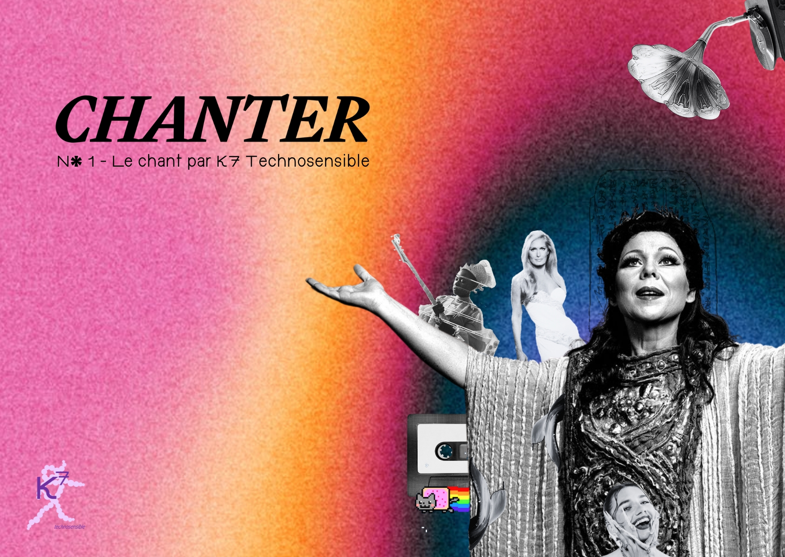

Title: Edito * CHANTER n°1 *
Date: 2024-08-25
Category: Media 🌺
Tags: Numero 1
Author: Myriam Hammad et Zoé Pasquier
Order: 1
Status: published

En décembre 2023, au détour de conversations avec nos proches, une question simple nous a révélé un univers fascinant : à quoi pensent-ils et quels moments leur apportent du plaisir ? De ces échanges, le chant a émergé comme une réponse récurrente, un écho des émotions humaines. C'est ainsi que le projet K7 Technosensible, encore embryonnaire, a trouvé sa première note. Notre mission : marier création et technologie pour de nouvelles expériences de l’information, questionner notre rapport au numérique et plus particulièrement à l’intelligence artificielle.e. Dans ce premier numéro, nous explorons le chant sous toutes ses formes, en mêlant poésie, histoire, et innovation technologique. Bienvenue dans un voyage où chaque mélodie raconte une histoire, chaque technologie ouvre une porte sur l'avenir, et chaque article est une invitation à rêver et réfléchir ensemble.

*Nos Rubriques*

Pour ce premier numéro, nous avons exploré les différents pans du chant : notre rubrique ***vidéo Pari Postal*** propose une approche rétrospective et prospective sur un lieu où l’on chante. Notre choix s’est porté sur le Palais Garnier puisqu’il regorge d’anecdotes et constitue l’un des emblèmes de la vie lyrique - clin d’oeil à la Gaîté Lyrique - *La joie qui chante -* où nous sommes nous-mêmes accueillies en résidence. Paradoxalement, proposer des représentations du futur par les nouvelles technologies et ce qu’on souhaiterait en faire, permet de ralentir, de donner une grille de lecture sur ce qui se passe à l’oeuvre  aujourd’hui et sur les usages que notre société pourrait en faire. En imaginant une institution qui serait à l’avenir décloisonnée, inscrite dans une politique urbaine de la ville, plus ouverte et inclusive, nous donnons aussi à voir les opportunités de demain et à éclairer des décisions du présent.

Dans un ***article  “Balade dans les chants*** “ composé de plusieurs chapitres, nous nous sommes plongées dans les origines du chant, la place qu’il prend dans l’ensemble de nos sociétés, l’universalité dont il est caractéristique et ses effets puissants sur nos affects et nos corps ainsi que sur les chants artificiels émergents. Chaque chapitre est accompagné d’un ***poème*** qui met en résonance les expressions liées aux sons de notre langage, à nos environnements sonores et à la manière dont ils font écho à nos souvenirs et histoires personnels.

Enfin, dans une émission sonore :  La Cassette, nous avons invité la DJ Alexi Shell à nous partager son univers onirique et à lui faire tester les outils d’IA repérés dans notre veille en lien avec la composition et la création de mélodies.

*Intuitions et issues*

Notre première exploration *technosensible* a confirmé nos intuitions : les outils d’intelligence artificielle sont de formidables amplificateurs pour ceux et celles qui maîtrisent déjà certains arts. Saluons Alexi, qui a brillamment réussi à distinguer l’IA des créations humaines dans notre jeu "IA ou pas" sur la K7, et remercions chaleureusement tous nos participantes et participants un peu plus déconcerté.e.s lors de notre lancement du 13 juin. 

Les différentes recherches faites sur ce sujet, nous ont aussi conduit à  de nouvelles observations : des difficultés à produire ce que l’on souhaite faire exactement du fait du monopole des sociétés américaines sur ces outils et sur leurs bases de données et d’entraînement. Des sujets sur la régulation de l’IA qui demeurent encore flous malgré des demandes d’éclaircissement répétés. En parallèle, ces outils d’IA nous donnent à voir de nouveaux formats déjantés : des reprises, des réels et des falsifications qui repoussent les frontières de la création. Une nouvelle culture internet s’empare de ces possibilités avec joie et légèreté, nous fait rire et est comment souvent, la première à donner de la voix.

Bonne Balade !

