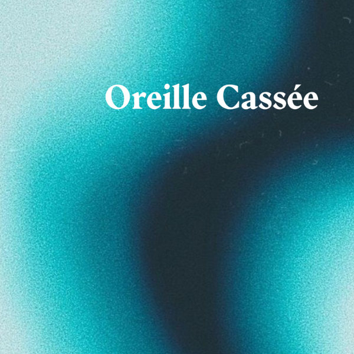
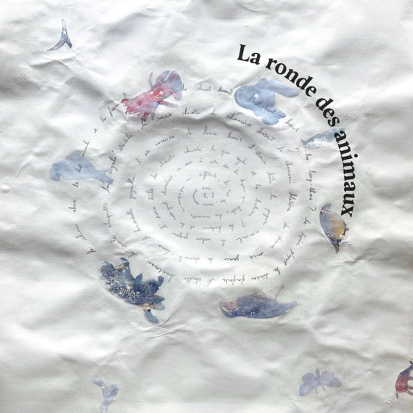
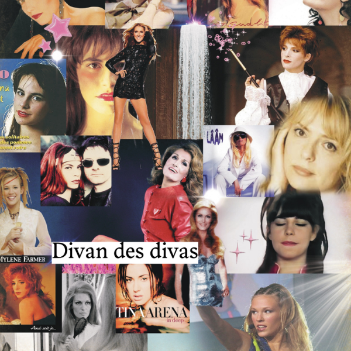

Title: Oreille Cassée * CHANTER n°1 *
Date: 2024-08-23
Category: Media 🌺
Tags: Numéro 1
Author: Zoé Pasquier
Order: 4
Status: published

  La rédaction de ces poèmes s’est faite sans IA, quelques tests ont été réalisés puis il a été admis que cette partie resterait de l’écriture sans création numérique, hormis pour la création des visuels, et encore, partiellement. Il s’agissait pour chacun d’entre eux d’accompagner des chapitres de l’article “ Balade dans les Chants “. Bonne lecture ! 

### L’ oreille cassée 

  

Oh la belle mélodie désarticulée.

Les cordes vocales s'envolent sur une gamme,

Sincères, malheureusement encore à côté…

L'audience supplie pourtant de suivre le programme,

Devant l'oreille et la voix jamais coordonnées,

C'est parfois le moustique que l'on préfère écouter.

La loi de la fausse note,

Et des chansons dissonantes

Passeront-elles le tamis de l'IA générative?

L'ordinateur peut-il copier la chorale désaccordée ?

A l'image du bug informatique, du code à la dérive,

Je souhaite que l'accident pour toujours se poursuive :

Programmateurs, à vous de perpétuer l'harmonie des oreilles cassées.

### La ronde des animaux 

  

Le chien aboie le chat miaule et la fourmi ? Le cheval hennit l’éléphant barrit et les      bary-thons ? Le lapin glapit le dindon glougloute l’abeille bourdonne la poule caquette la cigale stridule la souris chicote le chameau blatère le rhinocéros barrit la chauve-souris grince l’hirondelle gazouille le chevreuil brame l’oie cacarde le lama hennit l’otarie bêle le pigeon roucoule le cochon grogne et la chouette chuinte. Le geai cajole et la baleine ? La baleine et le rossignol chantent en coeur à côté de la hyène qui hurle, la marmotte accompagne en sifflant, le rat lui, couine doucement dans son coin.

### Le divan des divas

  

J'ai grandi avec la voix des divas. Un peu à la maison, mais surtout aux soirées du village, à la salle des fêtes, des soirées où les parents montaient sur les tables en plastique (pas du tout pensées à cet effet, elles penchaient sévère) pour s'égosiller après une certaine heure. Là Céline Dion, Dalida, là France Gall ou Tina Arena prenaient toute leur ampleur. Chantées par plein de poumons qui envoyaient toute leur force, les marathons à côté c'était rien du tout. Plus tard dans le sud ouest, les férias, les soirées, la tournée de Star 80, je reprenais le flambeau. Tout était chaos pour Mylène Farmer et pour ma voix aussi. 

En arrivant à Paris avec ma culture sud ouest, je trouvais les corps plus rangés à côté de moi, alors j'ai délaissé ce répertoire,troqué Lio pour Polo & Pan, Céline Dion pour Isaac Delusion, Françoise Hardy pour La femme - c'était stylé à l'époque. Je voulais faire partie de la culture majoritaire et c'était plus logique comme ça, sans elles. Je ne sais plus vraiment comment on s'est retrouvées, avec l'âge et le recul sur soi. Attendre trente ans pour chérir son héritage d'autant plus lorsqu'il n'est pas institutionnalisé ou underground ou stylé. Tout ça me fait penser à une association de psychanalystes fans de Dalida qui mériterait d'être créée : le divan des divas.